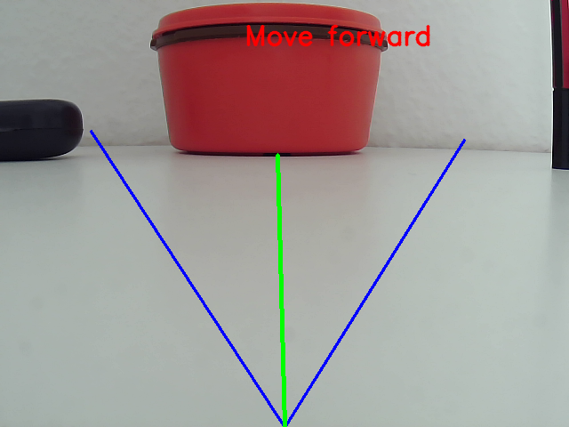
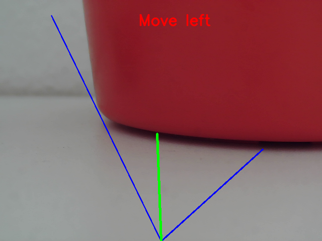
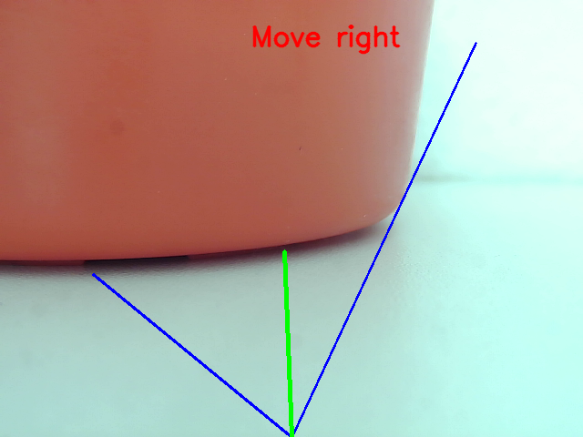

# Obstacle Avoidance of a 4 wheeled robot using OPENCV

## Objective

Nowadays robots are replacing many of the human jobs. As usage of robots has been increased, so do the problems to be solved. While navigating a robot, first and foremost it is very important to look into the safety of human around and of the robot. So, detecting obstacles and avoiding them efficiently is one of the challenge lies in the field of navigating. There exists different tackles in-order to detect objects present around. Some of the techniques are using laser scan, Lidar and using camera. Computer vision allows us with many functions to make the process of object obstacle easier. This project provides with a technique to detect obstacles using Canny edges function and Contour function available from OpenCV package. 

 

## Detection Methods

Appearance-based obstacle detection

 

Appearance-based obstacle detection is a method to find out appearance of an obstacle. Here cameras are used to capture images and then various image processing techniques are applied to find out an obstacle. Quality of an image matters in this appearance-based obstacle detection

 

Most used methos for Appearance-based obstacle detraction’s are, Canny, Sobel, Roberts and Prewitt.In this project, we are applying Canny edges to detect obstacles

 

## Methods

### Frame Capture
 In this we need to capture frames from live video stream which is needed for further processing. OpenCV provides a simple function to do this. To capture frames of a video, we create an object using ‘VideoCapture’ command. In this object we either pass the video file path or the webcam index (0 or 1). As we are using an external webcam, we are passing the webcam index of the value 1

![Original Image] Original_Frame1.png

 

### Noise Reduction
When any image is acquired or a frame is captured form a video, more often the frame is not usable for what it is intended to be used. The image may not be consistent and may have many random variations in illumination or poor quality and contrast, which must be taken care of in the initial stage of processing. Image noise reduction can be done using Gaussian Filter, Median Filter, Normalized Box Filter or Bilateral Filter
 

#### Bilateral Filter
This filter technique is used for smoothing of the image and making sure that the image does not have any kind of unwanted noise on the captured frame. One of the advantages of using bilateral filter is that unlike other filtering techniques, while it reduces the noise in an image it keeps the edges fairly sharp which is the most important factor for us in choosing this filter method.
 

### Canny Edge Detection
Canny edge detection is mainly used for detecting the edges in an image, without violating any structural properties of an image. Canny edge detection process contains multiple steps and those are
 

• Image filtering
• Image gradient calculation
• Non-maximum suppression
• Double threshold
• Edge tracking by hysteresis

![Canny Edge Detection] Canny1.png

 

### Thresholding 
Thresholding is one of the most important steps used in differentiating background and foreground. It helps in assigning of pixel values in relation to the threshold provided. In this technique each pixel value in the frame is compared to the threshold. If the pixel value is lower than the threshold it is set to 0 and if the values are greater than threshold it is set to maximum which is 255. This will clearly help in making the foreground completely white and the background black or vice versa. The function used for this is ‘cv2.threshold’.

![Thresholding Image] Threshold1.png

 

### Contour detection
Contour detection is a very useful method used in detection the shape of an object In front of the camera. It is a closed curve joining all continuous points having same Colour intensity. But when contour detection is applied on any image it detects internal contours too which are not required for obstacle detection. Hence, only external contours are detected by providing the function ‘findContours’ a filtered image as an input.

![Contour Detection] Contour1.png

 

## Pseudo Code for detecting obstacles and navigating a robot

*Get the frame form the video*

*Reducing the noise using bilateral filter*

*Edge detection using canny edge*

*Initialize the Edge array*

*Get the size (width and height) of the frame using ‘.shape’*

*FOR the length of width of the frame with the interval of five pixel:*

*FOR the length of height of the frame:*

*if pixel value = 255 then*

*Break*

*Append this pixel co-ordinates to Edge array*

*FOR the length of Edge array:*

*Draw line with consecutive Egde array points*

*FOR the length of Edge array:*

*Draw line with point at the bottom edge to respective point in edge array*

*FOR the length of Edge array with the interval of ‘length of Edge array/3’:*

*Store Edge array as three chunks*

*Calculate the average of each chunks and store in variable ‘c[left, forward, right]’*

*Draw three lines to these three points from center of bottom edge of the frame*

*Store the minimum value of ‘c’ in ‘y’ (minimum with respect to y co-ordinate)*

*if y coordinate value of c(forward) > 250 then:*

*if x coordinate value of ‘y’ < 310 then:*

*Move left*

*else:*

*Move Right*

*else:*

*Move Forward*

 

##Results

We ran the code for the background shown in original image. The navigation output is as shown below

**Move Forward**

 

**Move Left**

 

**Move Right**

 

##Conclusion

In conclusion, OpenCV and NumPy libraries were used to write the algorithm for obstacle avoidance. If we look closely at images in the results, this algorithm specifically works for clean background which does not have many colour variations. In such scenario we could successfully detect all the objects kept in the frame. Some issues where faced when detecting contours of an object which does not have colour contrast between background and that object
 
This project was completely done on Raspberry Pi 3 and a Webcam, it was never implemented on the real 4 wheeled robot due to lack of hardware required. This project can be further improved by using a pre-trained neural network which detect objects in any environment or creating new neural network altogether, which will help in better decision of objects which may further improve decision making of the robot.